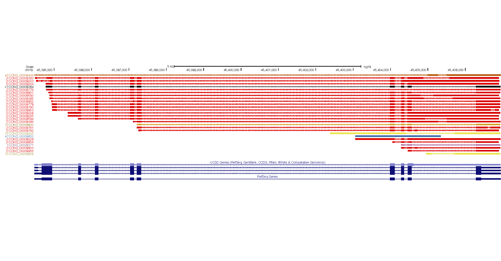
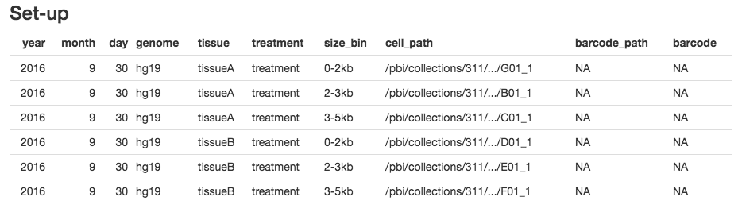
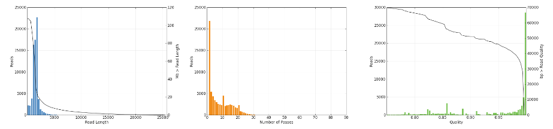
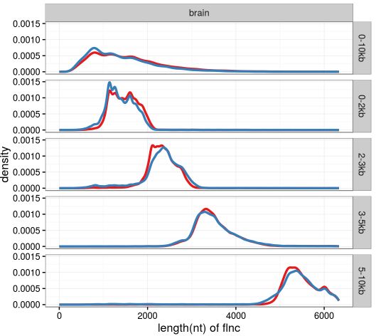
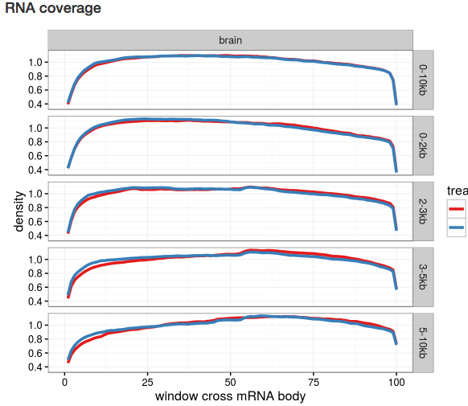
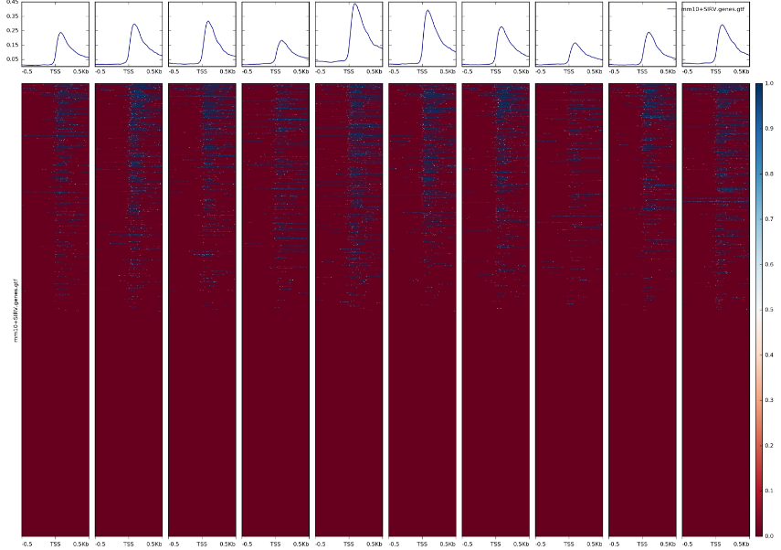
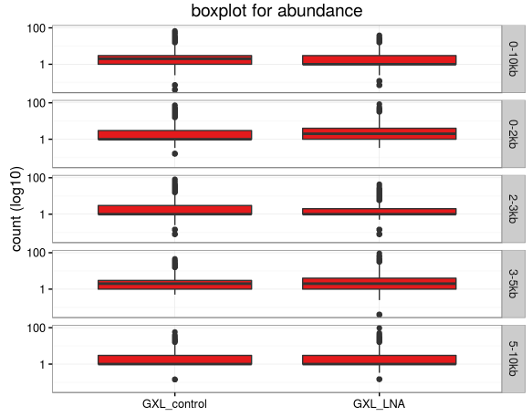
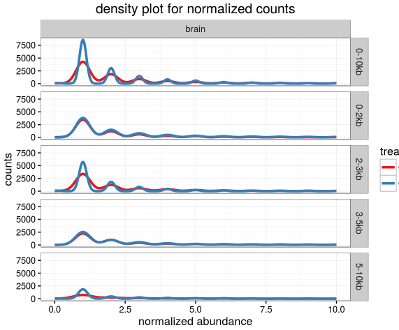
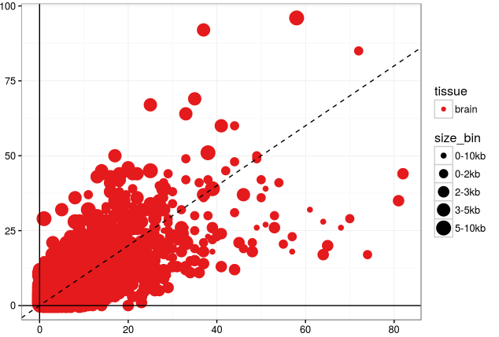

# pacbio_isoseq_pipeline

## Introduction
This is a pipeline wrapping different steps in PacBio Iso-Seq analysis from RS II cell (i.e. A01_1) to HTML reports ready to be presented, bigWig/bigBed files ready to be visualized in genome browsers.<br>

## Flow
This pipeline parse an input csv file and generate a batch of SGE jobs with dependencies. Smrtportal modules `Consensus` and `Classify` are run first. Barcoded libraries are splitted based on the barcode been identified on the `classify` stage. `Full-length, non-chimeric` reads generated by `Classify` are used to evaluate the RNA integrity, the precision of the 5' and 3' ends, and to quantify mRNAs in the annotation. Its output are organized into a few HTML and pdf files. In the meanwhile, `Cluster` job is run to generate consensus sequences for each mRNA, different categories of transcripts are identified using `cuffcompare` and presented as `bigBed` files, which can be loaded into genome browser to highlight novel transcripts.

## Install
The following software/tools are needed: <br>

-  **Linux enviroment with smrtanalysis_2.3.0.140936 installed**<br>
Specify the home of smrtanalysis in the `config/config.sh` file, such as 
```bash
declare -x SMRT_HOME='/pbi/analysis/smrtportal/beta/install/smrtanalysis_2.3.0.140936'
```

-  **SGE job submission envirment**<br>
Specify the job submission command in the `config/config.sh` file, such as
```bash
declare -x SUBMIT_CMD='qsub -V -cwd -pe smp 8 -l h_rt=240:0:0,mem_free=8G'
# -V: load enviromental variable
# -cwd: use current working directory 
# -pe smp 8: use smp 8 as the parallel enviroment; use `qconf -spl` to list all parallel enviroment
# -l: limitations, consult your SGE admin; a typical job runs overnight 
```
*Currently only SGE is supported*

- User specific directories set-up
Edit `config/config.sh` to specify the directory related enviromental variables, such as <br> 
```bash
# R libraries will be installed in this directory if not already exist
declare -x RLIBDIR='/home/bhan/Rlib'
# the directory storing genome sequence, index, and annotation files
declare -x ANNOTATION_DIR='/home/bhan/annotation'
```
It is likely that every user needs to have write permission in those directories.<br>

-  **Python3**<br>
Packages used: biopython
```bash
# to install
pip3 install biopython
```

-  **R**<br>
Relatively new version; missing packages will be installed automatically during the pipeline run.<br>
But it is highly recommended to install them beforehand.<br>
```R
# to install those packages
install.packages(c("readr", "dplyr", "tidyr", "rmarkdown", "corrplot", "ggplot2", "ggthemes"))
```

- **MySQL**<br>
If using the `annotation` pipeline to prepare for annotation files, MySQL is required to obtain certain files from UCSC.

- Other tools

&nbsp;&nbsp;&nbsp;&nbsp;&nbsp;&nbsp;&nbsp;&nbsp;&nbsp;&nbsp;&nbsp;&nbsp;&nbsp;[trim_isoseq_polyA](https://github.com/bowhan/trim_isoseq_polyA)

&nbsp;&nbsp;&nbsp;&nbsp;&nbsp;&nbsp;&nbsp;&nbsp;&nbsp;&nbsp;&nbsp;&nbsp;&nbsp;[mrna_size_from_gff and colmerge](https://github.com/bowhan/isoaux)

&nbsp;&nbsp;&nbsp;&nbsp;&nbsp;&nbsp;&nbsp;&nbsp;&nbsp;&nbsp;&nbsp;&nbsp;&nbsp;[gff2refFlat](https://github.com/bowhan/gfftools)

&nbsp;&nbsp;&nbsp;&nbsp;&nbsp;&nbsp;&nbsp;&nbsp;&nbsp;&nbsp;&nbsp;&nbsp;&nbsp;[deepTools](https://github.com/fidelram/deepTools)

&nbsp;&nbsp;&nbsp;&nbsp;&nbsp;&nbsp;&nbsp;&nbsp;&nbsp;&nbsp;&nbsp;&nbsp;&nbsp;[picard](https://broadinstitute.github.io/picard/)

&nbsp;&nbsp;&nbsp;&nbsp;&nbsp;&nbsp;&nbsp;&nbsp;&nbsp;&nbsp;&nbsp;&nbsp;&nbsp;[kent tools](https://github.com/ENCODE-DCC/kentUtils)

&nbsp;&nbsp;&nbsp;&nbsp;&nbsp;&nbsp;&nbsp;&nbsp;&nbsp;&nbsp;&nbsp;&nbsp;&nbsp;[gmap and gmap_build](http://research-pub.gene.com/gmap/)

## Usage

### Prepare the genomic annotation
```bash
# edit config file to specify your smrt analysis home and qsub enviroment
vi pacbio_isoseq_pipeline/config/config.sh 
# prepare genome sequence, annotation files using annotation pipeline
isoseq.sh anno -g hg19
isoseq.sh anno -g hg38
isoseq.sh anno -g mm10
isoseq.sh anno -g dm3
# the pipeline submits jobs to build gmap index, so please wait until those jobs finish before running analysis!

# 2. Prepare the sample information
# copy example.csv 
cp pacbio_isoseq_pipeline/sample/example.csv my_isoseq_sample.csv
# edit my_isoseq_sample.csv by filling it in your sample
vi my_isoseq_sample.csv
```
The user will need to fill the CSV file which specify the information needed, including:

<u>1.  **genome**</u><br>
- The name of the genome whose annotation has been obtained using the `annotation` pipeline.<br>
Specifically, the genome fasta and transcriptome genes.gtf files need to be presented in the `${ANNOTATION_DIR}` folder, which is defined in `config/config.sh`. <br>

- The "annotation" pipeline `isoseq.sh anno` prepares those files for popular genome assemblies using UCSC srouce.<br>

<u>2. **tissue**</u><br>
- Libraries of different tissues are compared separately.<br>

<u>3. **treatment**</u><br>
- Libraries of different treatment are compared directly.<br>

<u>4. **size bin**</u><br>
- The size bin used when the libraries are generated, like "1-3". <br>
Only libraries in the same size bins are compared directly. <br>

<u>5. **Path to the RS II cells**</u><br>
- The complete, ABSOLUTE path to the RS II cells (usually named as [A-Z]0[12]_1). <br>
- At least three `bax.h5` files are expected in the `Analysis_Results` subdirectory.<br>

<u>6. **Path to the custom (barcode) sequence file**</u><br>
- The absolute path to a fasta file with custom barcode sequence. 
- A barcode fasta file looks like:<br>
```
>F0
GCAGTCGAACATGTAGCTGACTCAGGTCACTCAGACGATGCGTCATGGTAGTAAGCAGTGGTATCAACGCAGAGTAC
>R0
GTACTCTGCGTTGATACCACTGCTTACTACCATGACGCATCGTCTGAGTGACCTGAGTCAGCTACATGTTCGACTGC
>F1
GCAGTCGAACATGTAGCTGACTCAGGTCACCTGCGTGCTCTACGACGGTAGTAAGCAGTGGTATCAACGCAGAGTAC
>R1
GTACTCTGCGTTGATACCACTGCTTACTACCGTCGTAGAGCACGCAGGTGACCTGAGTCAGCTACATGTTCGACTGC
>F2
GCAGTCGAACATGTAGCTGACTCAGGTCACCATAGCGACTATCGTGGGTAGTAAGCAGTGGTATCAACGCAGAGTAC
>R2
GTACTCTGCGTTGATACCACTGCTTACTACCCACGATAGTCGCTATGGTGACCTGAGTCAGCTACATGTTCGACTGC
```
With forward and reverse primer intervened. <br>
- If default primers are used (no barcode), fill `NA`.<br>
- If custom primers without barcodes are used, put its absolute path here and use `NA` in the next field.<br>
- If a mixture of barcodes are used, also put its absolute path here and use `NA` in the next field.<br>

<u>7. **Which barcode is used**</u><br>
- The position of the barcode FR pairs in the custom barcode fasta file. **Start counting from 0**.<br> 
- It has nothing to do with the names of any PacBio barcoding products.<br>
- If no barcode is used, fill `NA`.<br>
- Avoid using space, dot`.`, dash`-`. Use **underscore `_`** to separate words.<br>

#### It is recommended to start from the template in the `sample/example.csv` file. Do NOT change the header.<br>

```bash
# run the pipeline
isoseq.sh all -c my_isoseq_sample.csv -J myjobname -E my@emailaddress.com
```

## Output
<u>annotation</u><br>
- annotation files generated during the run will be stored here<br>
- the reason to store them inside of the run folder instead of the installation directory is to avoid racing between different jobs<br>

<u>bam</u><br>
- genome alignment `bam` files. Already sorted and indexed and can be loaded into genome browser directly<br>

<u>bed</u><br>
- genome alignment `bed` and `bigBed` files. 
- `gffcompare.combined.chained.code.bb` This `bigBed` file stored the "assembled transcriptome" from your IsoSeq run. Different transcripts are colored according to its relationship with the provided annotation, judged by `gffcompare/cuffcompare`<br> It can be directly loaded into UCSC genome browser using custom track or hub. <br> Such as 
```bash
track name="My IsoSeq Transcripts" type=bigBed itemRgb="On" visibility=full bigDataUrl="ftp://.../gffcomppare.combined.chained.code.bb"
```
And it looks like:<br>
<br>
- The type of the transcripts, defined by `gffcompare/cuffcompare` is prepended to the transcripts names. The complete code can be found [here](http://cole-trapnell-lab.github.io/cufflinks/cuffcompare/#transfrag-class-codes).<br> 
- Different types of transcripts are colored differently. For example, transcripts matching the intron chain with one of the annotated mRNAs (type `=`) are colored black, while novel transcripts (type `j`) are colored red.<br>

<u>bigWig</u><br>
- bigWig files for genome browser are stored in this folder<br>
- They can also be directly loaded into UCSC genome browser such as
```bash
track name="0-2kb.+" type=bigWig visibility=full color=0,0,255 maxHeightPixels=25:25:8 bigDataUrl=ftp://...Forward.bw
track name="0-2kb.-" type=bigWig visibility=full color=255,0,0 maxHeightPixels=25:25:8 bigDataUrl=ftp://...Reverse.bw
```
- Note that Watson and Crick strands are separated into two files<br>
- And Crick strand signals are all negated so that the signal goes down<br>

<u>fasta</u><br>
- `...0-2kb.CCS.fa`, `...2-6kb.CCS.fa`: the `consensus` sequences, with smrtbells removed, still with Iso-Seq adaptors on them.<br>
- `...0-2kb.isoseq_flnc.fasta`: the full-length, non-chimeric reads, in fasta format. The is the final output you will get when running `classify` job on smrtportal<br>
- `...0-2kb.isoseq_nfl.fasta`: the non-full-length reads in fasta format<br>
- `...0-2kb.isoseq_flnc.trima.fa`: the full-length, non-chimeric reads with more robust polyA trimming, which has not been incorporated into smrtanalysis<br>
- `...0-2kb.final.consensus.fa`: the output of isoseq `cluster` output, before `Quiver` polishing<br>
- `...0-2kb.all_quivered_hq.100_30_0.99.fasta`: the output of quiver-polished consensus<br>
- _Find more detailed explanations_ [here](https://github.com/PacificBiosciences/cDNA_primer/wiki/RS_IsoSeq-(v2.3)-Interpreting-Classify-and-Cluster-Output);

<u>fofn</u><br>
- all file of file names

<u>gff</u><br>
- `...isoseq_flnc.trima.hg19lnc.gtf`: GTF file storing the alignment of `flnc` reads to the genome<br>
- `gffcompare.combined.gtf`: the output of `gffcompare`, which combines `flnc` alignments together for quantification purpose<br>

<u>html</u><br>
- Where most reports are stored.<br>
- `gene_abundance.html` and `mRNA_abundance.html`: two HTML files to generate interactive scatter-plot. [This youtube video](https://www.youtube.com/watch?v=oEZtHHrW-9A) explains how to setup the plot<br>
- The final report:<br>
_setup_ <br>
<br>
_smrtpotal report_<br>
The images generated by smrtportal. Each Cell will have three images representing its `read length distribution`, `Number of passes`, and `Quality`. <br>
All barcoded libraries in the same cell are plotted together. <br>
<br>

_length distribution of full length non-chimeric reads_<br>
<br>

_RNA coverage_<br>
<br>

_Transcription Start/End Site (TSS/TES)_<br>
<br>

_The distribution of the abundances of each gene_<br>
<br>
<br>

_Scatter plot comparing two different tissues_<br>
- for a more interactive scatter plot, check `gene_abundance.html` and `mRNA_abundance.html`. <br>
<br>

_Correlation matrix between different samples_<br>
<br>

<u>jobout</u><br>
- the raw output of each job<br>

<u>jobs</u><br>
- the job script submitted to SGE<br>

<u>log</u><br>
- the log files for each SGE job<br>

<u>pdf</u><br>
- the pdf version of part of the report<br>

<u>table</u><br>
- `...isoseq_flnc.trima.sizes`: the size of each `full-length non-chimeric reads`<br>
- `...isoseq_flnc.trima.coverage.tsv`: the scaled, coverage plot for RNA integrity, calculated using `piccard`<br>
- `...isoseq_flnc.gene.count`: the count of each gene, using `full-length non-chimeric reads` by utilizing the `tmap` output of `cuffcompare`. Note that all categories (`=`, `c`, `j`, *et al*) are considered for gene counting<br> 
- `...isoseq_flnc.mRNA.count`: the count of each gene, using `full-length non-chimeric reads` by utilizing the `refmap` output of `cuffcompare`. Note that only `=` and `c` reads are used for mRNA. If one read matches *n* mRNAs in the annotation, each mRNA gets `1/n` counts from this read.<br>
- `gene.counts.tsv` `mRNA.counts.tsv` `coverage.tsv` `mRNA_gene.sizes.tsv`: information with all libraries